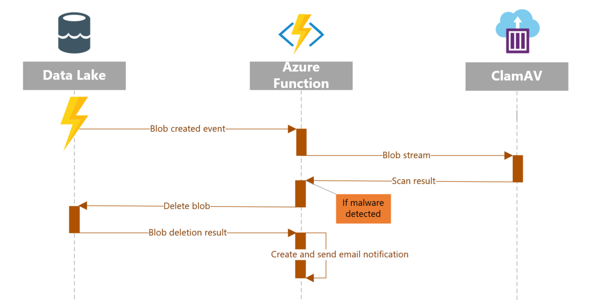

# Storage anti-malware sample

This solution detects and removes viruses and malware from a storage account automatically and without delay.

The functionality of the solution as shown in the image above:

1. A new/changed file/blob in storage account container triggers the anti-malware Azure Function method
1. The function method receives the stream of the new/changed file/blob and sends it to the ClamAV server for inspection
1. The ClamAV server scans the received stream
1. The function receives the result and if malware is detected:
    - The file/blob is automatically deleted using a Data Lake client
    - A notification email is sent to pre-defined recipients

## Getting started

The two deployment options provided are:

- [Quick deployment using a PowerShell script](./docs/deploying-with-script.md)
- [Deployment guide for deploying using pipelines in Azure DevOps](./docs/deploying-with-azdo.md)

## Main components

The solution consists of two services:

1. **Anti-malware function**: Azure Function (.NET Core) triggered when a new or changed blob is detected in storage account. The function will then scan the blob using [nClam ClamAV client](https://github.com/tekmaven/nClam) and if malware is detected, delete the blob and send a notification.
    - See the dedicated README file in [`/src/AntiMalwareFunction/README.md`](./src/AntiMalwareFunction/README.md).
1. **ClamAV server**: Contains the actual ClamAV antivirus software
    - [`Get-ClamAV.ps1`](./Get-ClamAV.ps1) script downloads the Docker image definitions for ClamAV server from [mko-x/docker-clamav](https://github.com/mko-x/docker-clamav) project and copies the Alpine version to `clamav-container` folder

## Contributing

See [CONTRIBUTING.md](CONTRIBUTING.md).
