# Deploying with Azure DevOps

This step-by-step guide explains how to deploy the storage anti-malware solution to Azure using Azure DevOps pipelines, and the configuration and few manual steps necessary.

> Note: For solving possible problems during deployment, see the separate [troubleshooting page](./troubleshooting.md).

Table of contents:

1. [Pipelines overview](#pipelines-overview)
    1. [Base infrastructure](#base-infrastructure)
    1. [Anti-malware pipeline](#anti-malware-pipeline)
    1. [Configuration](#configuration)
1. [Prerequisites](#prerequisites)
1. [Initial setup](#initial-setup)
    1. [Create resource group](#create-resource-group)
    1. [Acquire content to Azure DevOps repository](#acquire-content-to-azure-devops-repository)
    1. [Edit configuration](#edit-configuration)
    1. [Import pipelines](#import-pipelines)
1. [Deploying base infrastructure](#deploying-base-infrastructure)
    1. [Azure Resource Manager service connection](#azure-resource-manager-service-connection)
    1. [Run the base infrastructure pipeline](#run-the-base-infrastructure-pipeline)
1. [Deploying anti-malware setup](#deploying-anti-malware-setup)
    1. [Container registry service connection](#container-registry-service-connection)
    1. [Configure Key Vault](#configure-key-vault)
    1. [Run the anti-malware setup pipeline](#run-the-anti-malware-setup-pipeline)

## Pipelines overview

### Base infrastructure

Base infrastructure pipeline, as the name implies, deploys the base for the anti-malware setup. The base infrastructure here includes the following resources:

* [Monitoring](https://docs.microsoft.com/en-us/azure/azure-monitor): Application Insights and Log Analytics
* [Azure Key Vault](https://azure.microsoft.com/en-us/services/key-vault/)
* Storage account ([Azure Data Lake Gen2](https://docs.microsoft.com/en-us/azure/storage/blobs/data-lake-storage-introduction) in this case)
* [Azure Container Registry](https://azure.microsoft.com/en-us/services/container-registry/) (needed for ClamAV image built by the anti-malware setup pipeline)

 This pipeline is provided to make the project self-contained. For projects that already have the necessary resources deployed, it is enough to run the anti-malware setup pipeline. The pipeline is idempotent. In other words, if the resources already exist, running the pipeline does not change anything.

Base infrastructure pipeline hierarchy and dependencies:

```plaintext
create-base-infrastructure.yml
├── variables/dev-environment.yml
└── jobs/create-base-infrastructure-job.yml
    ├── /scripts/agent/Set-AgentTools.ps1
    ├── /scripts/environment/New-EnvironmentVariables.ps1
    ├── templates/log-analytics.yml
    │   ├── /arm-templates/log_analytics.parameters.json
    │   └── /arm-templates/log_analytics.json
    ├── templates/app-insights.yml
    │   ├── /arm-templates/app_insights.parameters.json
    │   └── /arm-templates/app_insights.json
    ├── templates/key-vault.yml
    │   ├── /arm-templates/key_vault.parameters.json
    │   └── /arm-templates/key_vault.json
    ├── templates/data-lake.yml
    │   ├── /arm-templates/data_lake.parameters.json
    │   └── /arm-templates/data_lake.json
    └── templates/container-registry.yml
        ├── /arm-templates/container_registry.parameters.json
        └── /arm-templates/container_registry.json
```

### Anti-malware pipeline

Anti-malware pipeline will deploy the malware detection specific resources:

* [Azure Container Instances](https://azure.microsoft.com/en-us/services/container-instances/) for running the ClamAV image
* [Azure Functions](https://docs.microsoft.com/en-us/azure/azure-functions/) application that monitors the storage container

Like the base infrastructure pipeline, this pipeline too is idempotent.

Anti-malware setup pipeline hiearchy and dependencies:

```plaintext
create-anti-malware-setup.yml
├── variables/dev-environment.yml
└── jobs/create-anti-malware-setup-job.yml
    ├── /scripts/environment/New-EnvironmentVariables.ps1
    ├── templates/aci-anti-malware.yml
    │   ├── /arm-templates/aci_antimalware.parameters.json
    │   └── /arm-templates/aci_antimalware.json
    └── templates/azure-function-anti-malware.yml
        ├── /arm-templates/azure_function_antimalware.parameters.json
        └── /arm-templates/azure_function_antimalware.json
```

### Configuration

The configuration variables are defined in [`/pipelines/variables/dev-environment.yml`](/pipelines/variables/dev-environment.yml) YAML file. The file used by both the base infrastructure and the anti-malware setup pipelines. See the inline documentation in [the file](/pipelines/variables/dev-environment.yml) itself.

The default variable values would create resources with the names as seen in the image below:


> **Note:** Some names of the resources have limits as low as 16 characters (see [resource naming restrictions](https://docs.microsoft.com/en-us/azure/azure-resource-manager/management/resource-name-rules)). If a name is too long, the pipeline will fail to deploy the resource. Keep this in mind when modifying the variable values.

## Prerequisites

* Azure subscription with provileges to create resources and modify access policies
* [Azure DevOps](https://azure.microsoft.com/en-us/services/devops/) access with privileges to create repositories, change project settings and create service connections
* Basic knowledge of Git and [tools](https://git-scm.com/downloads) installed

Recommended tools:

* [Visual Studio Code](https://code.visualstudio.com/)
* [Azure Storage Explorer](https://azure.microsoft.com/en-us/features/storage-explorer/)

## Initial setup

### Create resource group

[Create a resource group](https://docs.microsoft.com/en-us/azure/azure-resource-manager/management/manage-resource-groups-portal) in Azure.

The default resource group name in the configuration is "`storage-av-demo-rg`". If you want to use a different name, make sure to [edit the value in configuration](#edit-configuration).

By default, the [configuration](#configuration) will try to deploy to  location (region) "**(Europe) West Europe**". If your prefer [another region](https://azure.microsoft.com/en-us/global-infrastructure/geographies/), make sure to [reflect this decision in the configuration](#edit-configuration) later.

### Acquire content to Azure DevOps repository

Get the content of this project into a repository in Azure DevOps: [Create a new Git repository](https://docs.microsoft.com/en-us/azure/devops/repos/git/create-new-repo?view=azure-devops), copy and push the content from this project there - OR - [fork the repository](https://docs.microsoft.com/en-us/azure/devops/repos/git/forks?view=azure-devops&tabs=visual-studio).

### Edit configuration

1. Open the file [`/pipelines/variables/dev-environment.yml`](/pipelines/variables/dev-environment.yml) in your repository for editing
1. Make sure the value of `resourceGroupName` matches the resource group you created earlier
1. If you chose region other than **West Europe**, change the value of `location` to match
1. The prefix for resource names is defined by the `resourceNamePrefix` variable - it is recommended to change the default value to avoid collisions (some of the resources require a unique name)
    * Suggestion: Replace the four zeros in the default value with a number you like
1. Commit and push the changes to the repository

> If you want to further customize the configuration, go ahead but note that the impact of those changes may not be covered by this guide.

Revisit [Configuration section](#configuration) for details.

### Import pipelines

1. Navigate to **Pipelines** in Azure DevOps
1. Click **Create pipeline** (in case this is the first one) or **New pipeline**
1. Select **Azure Repos Git**
1. Select the newly created/forked repository
1. Select **Existing Azure Pipelines YAML file**

    

1. Click **Continue**
1. Do not run the pipeline yet - instead from the drop-down menu part of the *Run* button, select **Save**

    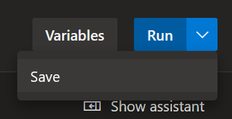

1. From the drop-down menu (three dots), select **Rename/move**

    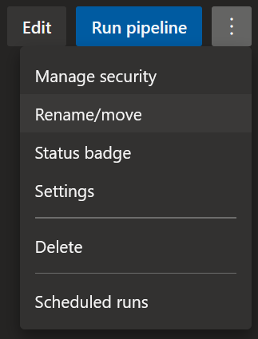

1. Enter a name better describing the pipeline, e.g. "Storage anti-malware base infrastructure", so that you can differentiate it later and click **Save**

Execute the steps above for pipelines files:

* `/pipelines/create-base-infrastructure.yml` and
* `/pipelines/create-anti-malware-setup.yml`

## Deploying base infrastructure

### Azure Resource Manager service connection

First a [Azure Resource Manager service connection](https://docs.microsoft.com/en-us/azure/devops/pipelines/library/connect-to-azure?view=azure-devops) must be created to allow Azure DevOps pipelines to access and deploy resources to a resource group in Azure:

1. In Azure DevOps, navigate to **Project settings**
1. Under **Pipelines** select **Service connections**
1. Click **New service connection**
1. For connection type, select **Azure Resource Manager**

    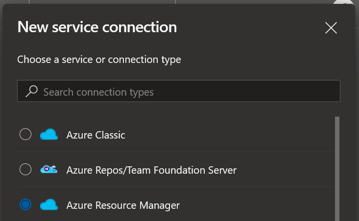

1. For authentication method, select **Service principal**

    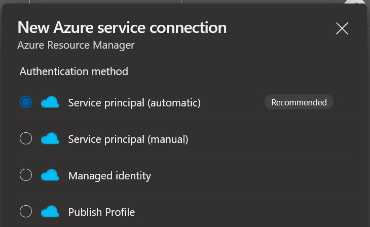

1. Select the subscription and the resource group you want to deploy the resources to

    > **Note:** The resource group name and the service connection name need to match the ones in `dev-environment.yml` variables. By default, the expected service connection name is "`<your resource group name>-sc`". See [Edit configuration](#edit-configuration) for more details.

    

1. Click **Save** to finish

### Run the base infrastructure pipeline

1. Navigate to **Pipelines** in Azure DevOps
1. Open **All** (pipelines) tab

    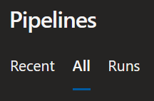

1. Select the base infrastructure pipeline from the list
1. Click **Run pipeline** button
1. Click **Run**

Successful base infrastructure pipeline run:

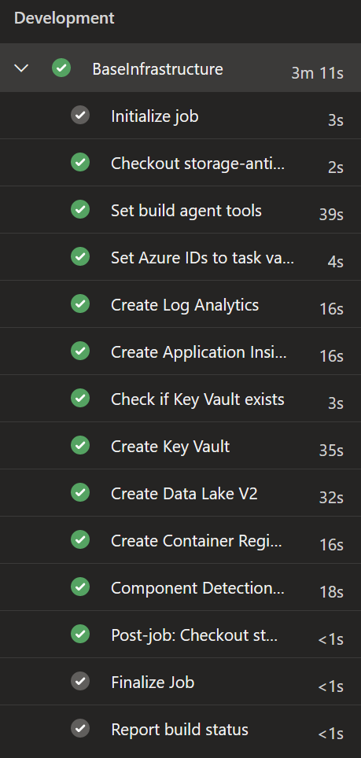

> See [toubleshooting page](./troubleshooting.md) in case of problems.

## Deploying anti-malware setup

### Container registry service connection

First, a service connection, to enable access to the container registry created by the base infrastructure pipeline, must be created:

1. In Azure DevOps, navigate to **Project settings**
1. Under **Pipelines** select **Service connections**
1. Click **New service connection**
1. This time select **Docker Registry**

    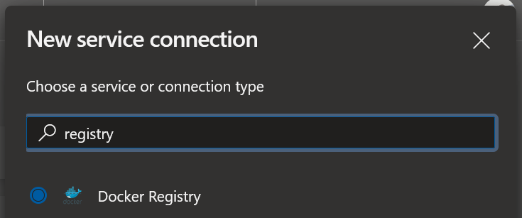

1. Set the type as **Azure Container Registry**, select the correct subscription and the name of the registry created by the base infrastructure pipeline

    > **Note:** The name of the container registry and the service connection (`containerRegistryServiceConnectionName` variable) need to match the ones in `dev-environment.yml` variables. By default, the expected ACR service connection name is "`<your ACR resource name>-sc`". See [Edit configuration](#edit-configuration) for more details.

    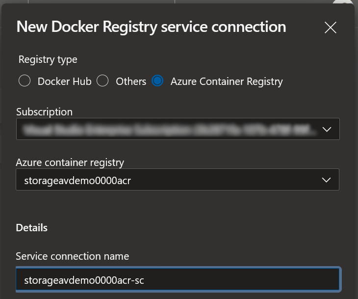

1. Click **Save** to finish

### Configure Key Vault

Make sure the service principal of the **Azure Resource Manager** service connection is allowed to read the secrets in the Key Vault instance:

1. Resolve the service principal ID of the **Azure Resource Manager** service connection
    1. In Azure DevOps navigate to **Project Settings** and locate the service connection
    1. Click **Manage Service Principal** to open the service principal settings in Azure Portal

        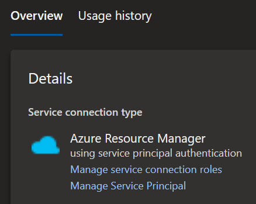

    1. Make note of the **display name** and the **application (client) ID** of the service principal
1. Create a new Key Vault access policy for the service connection
    1. In Azure Portal navigate to the Key Vault instance
    1. Under **Settings** select **Access policies**
    1. Click **Add Access Policy**
    1. Select "Key, Secret, & Certificate Management" template
    1. Select the service principal of the service connection (matching the display name and application ID resolved in the first step)

        

    1. Click **Add**
    1. Click **Save**

1. Add Outlook secrets to Key Vault:

    > **Note:** The solution will work even if the Office/Outlook settings are not configured properly, but will throw an error in the logs. Nevertheless, the secrets "smtpUsername" and "smtpPassword" **must be defined** in Key Vault or the pipeline will fail.

    1. In Azure Portal navigate to the Key Vault instance
    1. Under **Settings** select **Secrets**

        > You may not have permissions to list and create secrets by default. In that case you will see a message saying *"The operation "List" is not enabled in this key vault's access policy."* To give yourself the required permissions repeat the previous main step (new access policy), but instead of the service connection, choose your user's principal (tip: search the principal using your email address).

    1. Click **Generate/Import**
    1. Fill in the details:
        1. Name: **smtpUsername**
        1. Content type: **text/plain**

            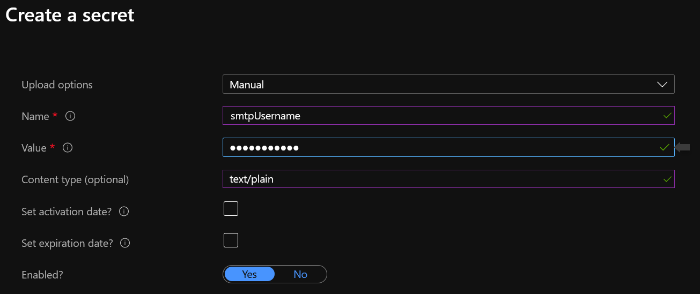

    1. Click **Create**
    1. Repeat the steps above, but for secret with name "**smtpPassword**"

### Run the anti-malware setup pipeline

Follow the steps in [Run the base infrastructure pipeline](#run-the-base-infrastructure-pipeline) section, but this time select the anti-malware setup pipeline.

Successful anti-malware setup pipeline run:

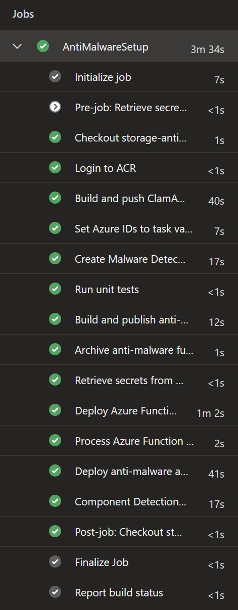

## Testing the solution

See separate page: [Testing the solution](./testing-solution.md)
